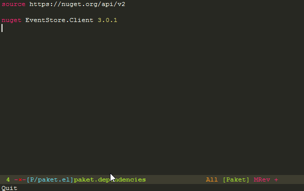

# paket.el
[Paket](http://fsprojects.github.io/Paket/) tooling for Emacs.  Only for the brave; very much WIP.



## Installation

### Manual

For the moment, the only way to install paket.el is by 'require'ing it:

```el
(add-to-list 'load-path "~/.emacs.d/paket.el/")
(require 'paket)
```

## Usage

| <code>M-x</code> command | Description |
| -------------------------|-------------|
| <code>paket-install</code>| Runs _paket install_ |
| <code>paket-add-nuget</code>| Asks for the package name in the minibuffer and runs _package add nuget PACKAGE_ |
| <code>paket-outdated</code>| Runs _paket outdated_ |
| <code>paket-restore</code>| Runs _paket restore_ |
| <code>paket-remove</code>| Lists the currently installed packages (excluding transitive dependencies) and runs _paket remove nuget_ on the selection |
| <code>paket-update</code>| Runs _paket update_ |

### paket.dependencies

A paket.dependencies buffer supports the following commands:

| Keybinding | Runs |
|------------|-------------|
|<kbd>C-c C-i</kbd>| paket-install |
|<kbd>C-c C-a</kbd>| paket-add-nuget |
|<kbd>C-c C-o</kbd>| paket-outdated |
|<kbd>C-c C-r r</kbd>| paket-restore |
|<kbd>C-c C-r m</kbd>| paket-remove |
|<kbd>C-c C-u</kbd>| paket-upate |
